# Getting Up & Running With BrowserSpy

## Visit [https://www.browserspy.io/](https://www.browserspy.io/) and register

We have started our Beta Trial so your first step is to let us know that you would like to help us with the initial public testing of BrowserSpy

You will then receive a simple email from us that details the next steps


BrowserSpy uses GitHub as its login mechanism so you will need a GitHub account

Sign up here [https://github.com/join?source=header-home](https://github.com/join?source=header-home)


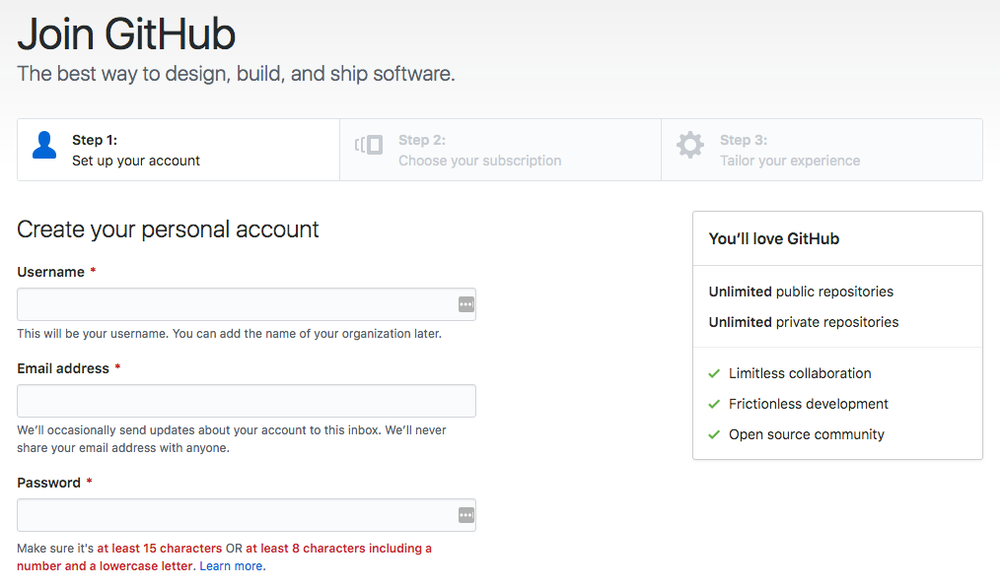

## Go to [https://app.browserspydev.com](https://app.browserspydev.com)

Sign in with your GitHub account

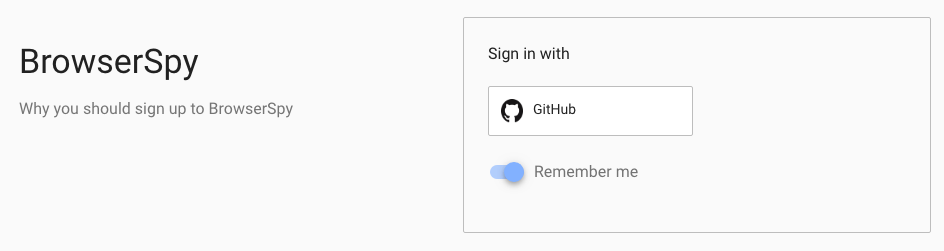

Once signed in you will then need to Authorise BrowserSpy

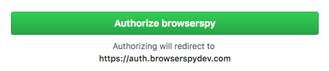

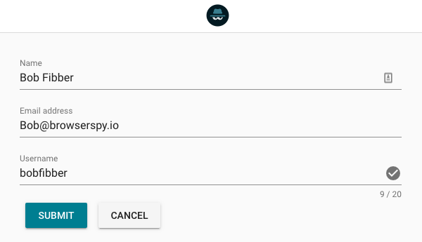

Complete the Name, Email address & Username fields

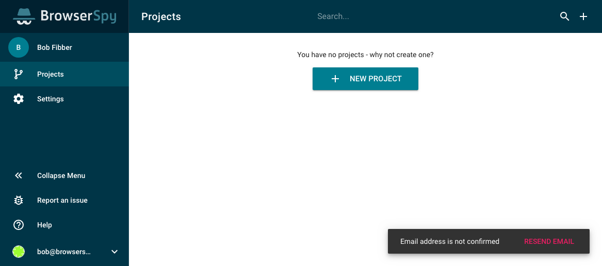

You are now logged into BrowserSpy. Please check your inbox for an email from BrowserSpy. Click the link contained within the message to confirm your email address.

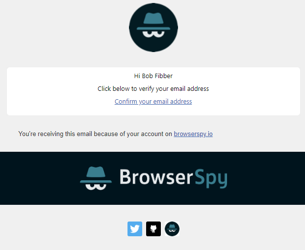

Once your email address is confirmed, then the "email address not confirmed" modal will be removed and you will be prompted to create your first BrowserSpy project.

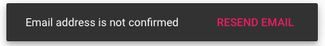

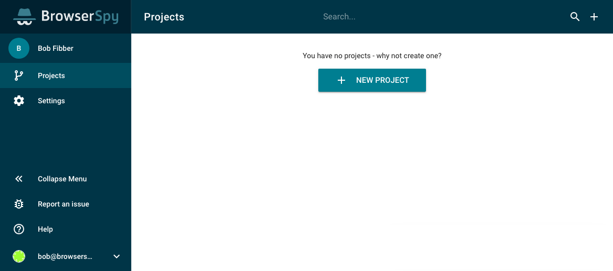

## Create "+ NEW PROJECT"

You can now click on the "+ NEW PROJECT" button

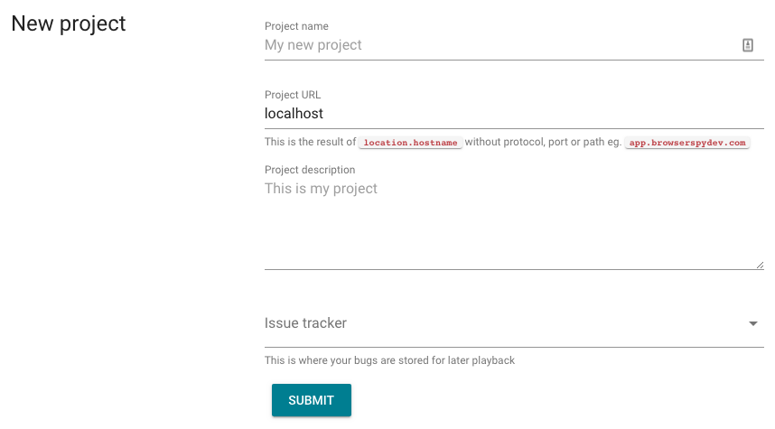

Enter details specific to your project and click the "SUBMIT" button

The Project URL is the result of `location.hostname` which means using the URL without `HTTP://` or `HTTPS://` and without Port Numbers e.g. `:8080` 

This is used to identify your instance of the BrowserSpy Recorder together with the Project Token 

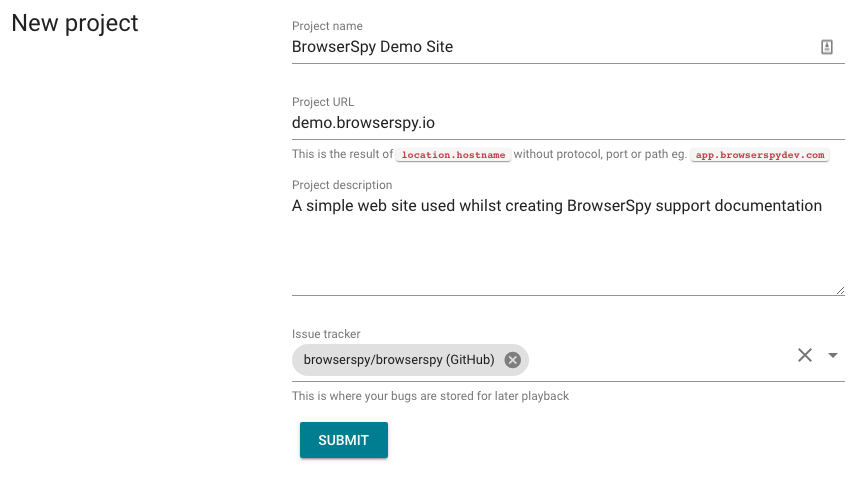

You should now see the four main tabs for administering your BrowserSpy Project

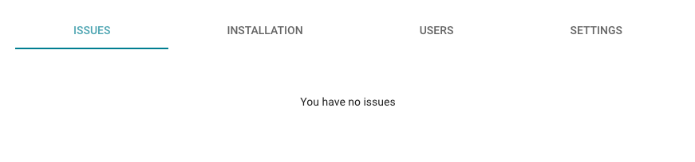

## Installation of BrowserSpy \(JavaScript\)

Click the "INSTALLATION" tab and try the JavaScript option to begin with, as this will allow you to test very simply on your local machine

Once you have copied the JavaScript code into your application, refresh your browser and you should see the BrowserSpy toolbar on your web page.

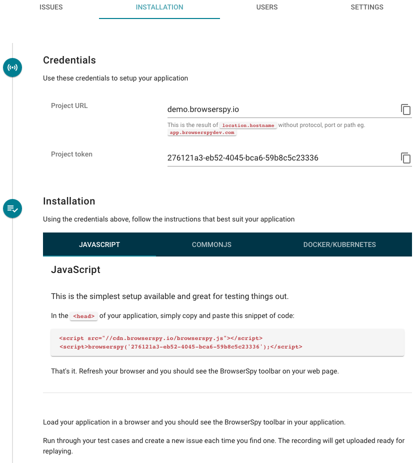

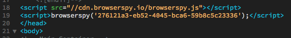

Now visit your Project URL, and you should see the magnificent BrowserSpy Control Panel displayed on your site

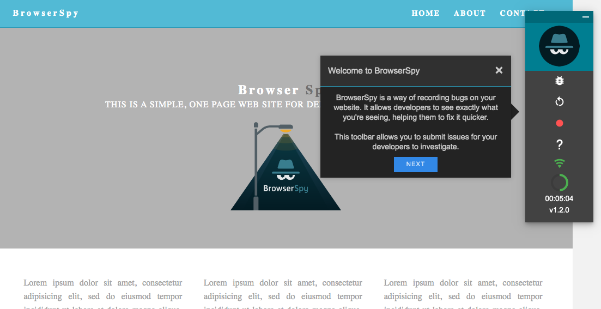

There are two additional BrowserSpy installation options which you can use \([CommonJS](commonjs-installation.md) & [Docker/Kubernetes](docker-kubernetes-installation.md)\) for which a walkthroughs are provided

But first let's go and run through our first Test Case, record it with BrowserSpy and log our first issue

