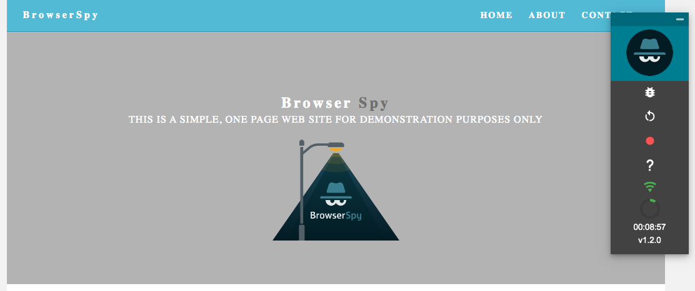

# Test Case and Logging An Issue

## Simple Test Case

### I want to check the navigation links in the top menu

Visit your Project URL where you should see the BrowserSpy Control Panel

As you can see the BrowserSpy Control Menu is obscuring part of the screen that we want to test, so we can 'grab' the Control Menu and move it so that we can see the navigation links clearly

